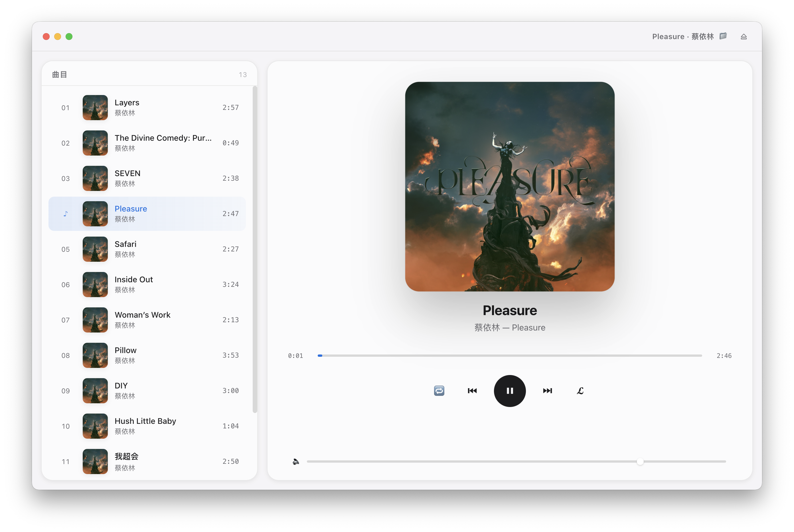
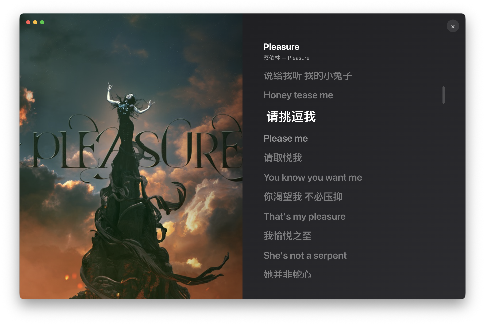

# 🎵 Pleasure Player

> **📥 [Download v0.1.0 for macOS (Apple Silicon · 93 MB)](https://github.com/Lenny-lab/Pleasure_player/releases/latest)**
>
> Apple-style local music player — lock a folder, drop in audio files, get instant Apple-Music vibes.



An Electron-based desktop music player that **watches a local folder for audio files** and instantly shows them in a clean, macOS-Apple-Music-inspired interface. Built as a focused, single-purpose alternative to heavyweight music managers.

---

## ✨ Features

- 🔒 **Folder lock** — pick a directory once, the player remembers it.
- 👀 **Live watch** — drop new audio files in, they appear in the playlist within ~1s. Delete a file, it disappears. No rescan, no restart.
- 🎵 **Broad format support** — FLAC (incl. 24-bit Hi-Res), MP3, M4A, AAC, OGG, WAV.
- 📝 **LRC lyrics sync** — automatic line-by-line highlight with full-screen karaoke view.
- 💿 **Embedded album art** — parsed from file metadata, no extra files needed.
- 🍎 **Apple-style UI** — SF Pro, large rounded corners, vibrancy blur, generous whitespace, smooth 60fps animations.
- ⌨️ **Keyboard shortcuts** — `Space` play/pause · `←/→` prev/next · `Esc` close lyrics.
- 🪶 **Tiny footprint** — no frontend framework, ~25KB of renderer code; main process is ~10KB.

---

## 📸 Screenshots

| Main interface | Lyrics view |
| :---: | :---: |
|  |  |

---

## 💭 Why this project

This project was born out of a very specific frustration.

蔡依林（Jolin Tsai）的专辑 *Pleasure* 一直没有上架 Apple Music。想听的话只能去贴吧 / 网盘下载 FLAC 资源——虽然专辑有了本地音源，但要想真正在 Apple Music 里播放，导入、配库、传到设备这一整套流程必不可少，可自己也实在不想折腾。直接双击文件用 QuickTime 听？又没法看歌词、控制前后曲目。

于是就有了 **Pleasure**：

- **零配置** —— 不用建库、不用导入、不用登录账号
- **文件夹即曲库** —— 拖一个文件夹进去就开始播放，新增歌曲自动入列
- **本地优先** —— 你的音乐文件不离开你的硬盘
- **苹果风** —— macOS 用户应该有的体验

虽然起因是一张专辑，但 Pleasure 不是 *Pleasure-album* 专属的——任何 Mac 用户想轻量地播放本地音频都能用。

项目名 / 应用名 / 包名都跟着专辑叫 `Pleasure`——算是对 Jolin 这次没上架的一个吐槽彩蛋。

---

## 🚀 Quick Start

### Prerequisites

- **Node.js ≥ 20** (see `.nvmrc`)
- **macOS / Windows / Linux** (full feature set on macOS)

### Install & run

```bash
git clone https://github.com/lennyli/pleasure-player.git
cd pleasure-player
npm install
npm start
```

> **🇨🇳 China network users:** set the Electron mirror before `npm install`:
> ```bash
> export ELECTRON_MIRROR=https://npmmirror.com/mirrors/electron/
> npm install
> ```

On first launch the app scans the configured directory (default: `~/Downloads`),
then **watches it live** — drop new files in and they'll appear immediately.

### Test mode (auto-play first track on boot)

```bash
npm run start:test
```

---

## 🎮 Usage

| Action | How |
| --- | --- |
| Play / pause | Click the centered `▶ / ⏸` button, or press `Space` |
| Next / prev | `⏮ ⏭` buttons or `← / →` |
| Seek | Click or drag anywhere on the progress bar |
| Volume | Drag the slider at the bottom of the now-playing panel |
| Shuffle | Click `🔀` in the controls |
| Switch folder | Click `⇄` in the title bar, or **File → Switch Music Folder…** (`Cmd+O`) |
| Reveal in Finder | Click `📁` in the title bar, or **File → Reveal in Finder** |
| Lyrics | Click `𝓛` in the controls, or click any lyric line to jump |

### Default music folder

Edit the constant at the top of `main.js`:

```js
const DEFAULT_MUSIC_DIR = '/path/to/your/music';
```

Or change it via the UI — the choice is persisted to
`~/Library/Application Support/pleasure-player/config.json` (macOS) /
`%APPDATA%/pleasure-player/config.json` (Windows) / `~/.config/pleasure-player/config.json` (Linux).

---

## 🏗️ Architecture

```
┌─────────────────────────────┐
│  Electron main process      │  ← Node.js
│  - scan folder              │
│  - chokidar file watcher    │
│  - music-metadata (parse)   │
│  - register music:// scheme │
└──────────┬──────────────────┘
           │ IPC (contextBridge)
┌──────────▼──────────────────┐
│  Renderer (Chromium)        │  ← Vanilla HTML/CSS/JS
│  - <audio> + FLAC playback  │
│  - Apple-style UI           │
│  - LRC sync                 │
└─────────────────────────────┘
```

**Three design decisions worth knowing:**

1. **No frontend framework.** The renderer is plain HTML + CSS + JS (~25KB total).
   The whole UI is built with native browser APIs — `<audio>`, `fetch`, `URL`.
2. **Custom `music://` protocol** instead of `webSecurity: false`. The protocol
   handler is sandboxed to only serve files inside the locked music directory.
3. **Streaming IPC** for album art — cover image is embedded as `data:` URI in
   the track object, so the renderer never makes a second request for art.

```
music://app/Users/foo/.../track.flac
         │
         ▼
   main process:  decodeURIComponent → path must start with MUSIC_DIR
         │
         ▼
   net.fetch('file://' + path)  →  audio element gets bytes
```

---

## 📦 Build & Release

The project ships with `electron-builder` configured for all three platforms.

```bash
npm run build:mac      # → dist/Pleasure-0.1.0-arm64.dmg (Apple Silicon only)
npm run build:win      # → dist/Pleasure-0.1.0-x64.exe (NSIS installer)
npm run build:linux    # → dist/Pleasure-0.1.0-x64.AppImage + .deb
```

Outputs land in `dist/`. The configuration in `electron-builder.yml` will
**use the default Electron icon** until you add a real icon to `assets/`:

- `assets/icon.icns` (macOS, 512×512+)
- `assets/icon.ico` (Windows, 256×256+)
- `assets/icon.png` (Linux, 512×512+)

Uncomment the corresponding lines in `electron-builder.yml` once you have them.

### Cross-platform notes

| Platform | Status | Notes |
| --- | --- | --- |
| macOS (arm64 / Apple Silicon) | ✅ Full | Vibrancy blur, hidden-inset titlebar, traffic-light positioning |
| Windows 10/11 | ✅ Works | Vibrancy falls back to flat background; build an NSIS installer |
| Linux (Ubuntu/Fedora) | ✅ Works | Build AppImage; vibrancy falls back; needs `libnss3 libgtk-3-0 libasound2` at runtime |

---

## 🛣️ Roadmap

- [ ] **Spectrum visualizer** — Web Audio AnalyserNode → canvas bars
- [ ] **Recursive folder watch** — currently only watches top level
- [ ] **Last-played persistence** — remember position across sessions
- [ ] **Search / filter** in playlist
- [ ] **MPRIS support** on Linux (media keys integration)
- [ ] **Mini-player mode** (floating compact window)
- [ ] **i18n** — currently zh-CN + en only mixed

---

## ⚠️ Known limitations

- 24-bit/48kHz FLAC triggers a benign FFmpeg warning
  `Unsupported pixel format: -1` in the dev console — playback is unaffected.
- The folder watcher only watches **the top level** of the locked directory
  (sub-folders are ignored).
- Album art larger than ~3MB may slow initial scan due to base64 encoding.

---

## 🧑‍💻 Development

```bash
npm start              # normal boot
npm run start:test     # boot + auto-play first track (good for screenshots)
```

The renderer talks to the main process through `window.musicAPI` (defined in
`preload.js`). All Node-side capabilities are sandboxed via `contextBridge`.

When debugging the protocol handler, the `--autoplay` flag injects a play
command ~800ms after boot, which is the cheapest way to verify a new audio
file plays through the custom scheme.

---

## 📄 License

MIT © 2026 [Lennyli](https://github.com/lennyli)

See [LICENSE](LICENSE) for the full text.

---

## 🙏 Acknowledgements

- [music-metadata](https://github.com/Borewit/music-metadata) — robust FLAC / MP3 / M4A metadata parsing
- [chokidar](https://github.com/paulmillr/chokidar) — cross-platform file watching
- [Electron](https://www.electronjs.org/) — the platform that makes this possible
- 蔡依林 / Jolin Tsai — *Pleasure* album, the original design inspiration 🌸
